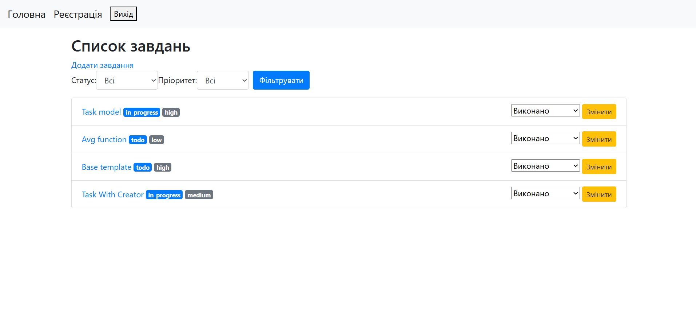
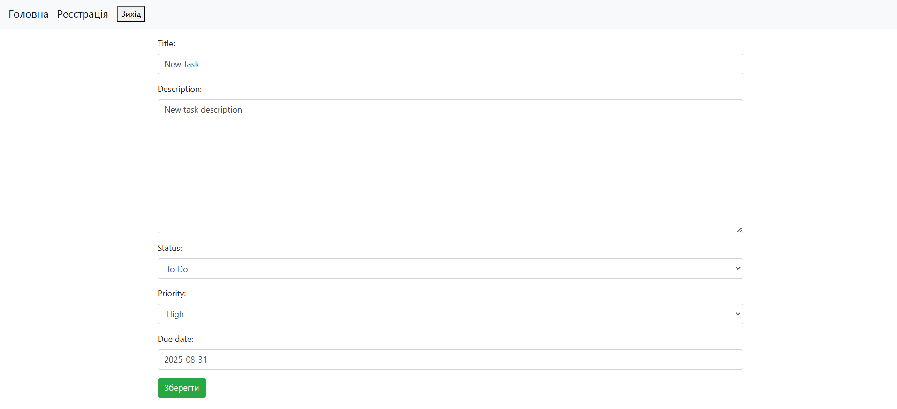
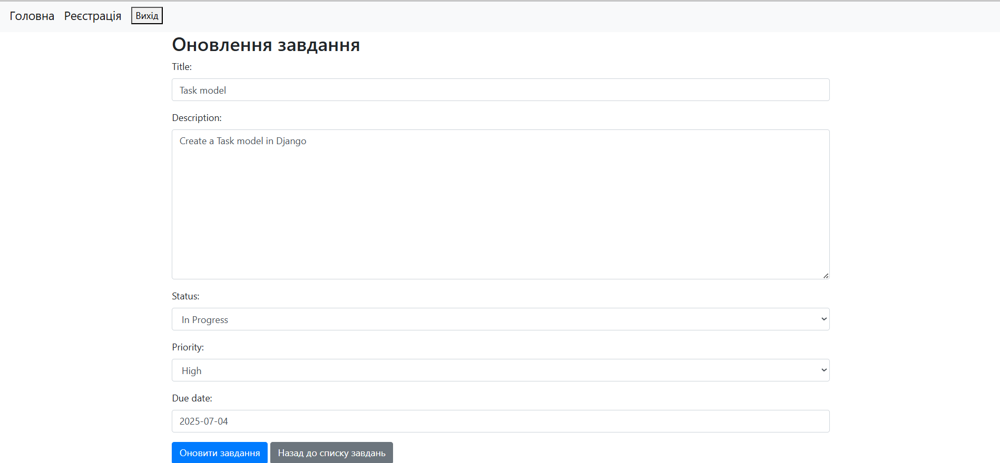
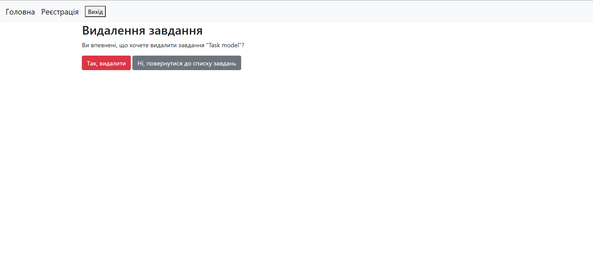
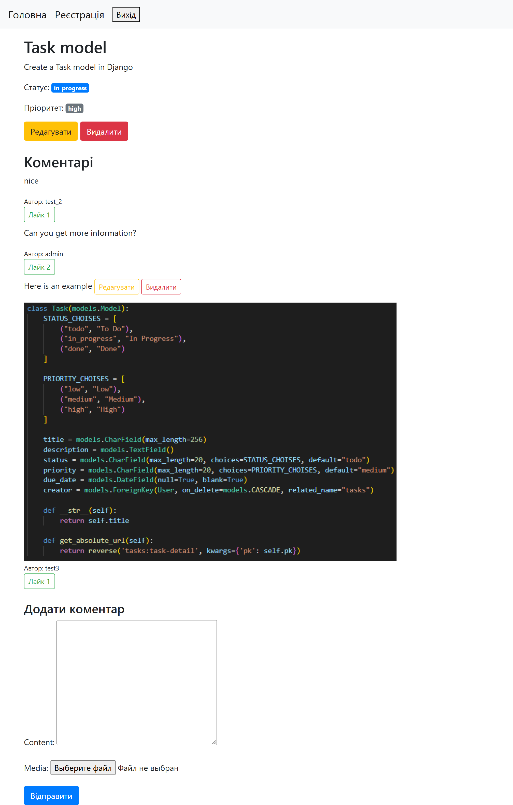

# Task Tracking Django Application

## Overview
Task Tracking is a Django-based web application designed for managing tasks. Users can create, view, update, and delete tasks, as well as add comments, like comments, and filter tasks by status and priority. The application includes user authentication for secure access and restricts certain actions (e.g., editing or deleting tasks/comments) to the task or comment creator.

## Features
- **Task Management**: Create, view, update, and delete tasks with fields for title, description, status, priority, and due date.
- **Comment System**: Add, edit, and delete comments on tasks, with support for file uploads (media).
- **Like System**: Toggle likes on comments, with unique likes ensured per user and comment.
- **Task Filtering**: Filter tasks by status (To Do, In Progress, Done) and priority (Low, Medium, High).
- **User Authentication**: Register, log in, and log out with Django's built-in authentication system.
- **Ownership Restrictions**: Only task creators can update, delete, or change the status of their tasks, and only comment authors can edit or delete their comments.
- **Responsive Forms**: Forms are styled with Bootstrap classes for a consistent look.

## Technologies Used
- **Django**: Backend framework (version 5.2).
- **SQLite**: Default database for development.
- **Bootstrap**: For styling forms and templates.
- **Python**: Core programming language.

## Installation
1. **Clone the Repository**:
   ```bash
   git clone <repository-url>
   cd task_tracking
   ```

2. **Set Up a Virtual Environment**:
   ```bash
   python -m venv venv
   source venv/bin/activate  # On Windows: venv\Scripts\activate
   ```

3. **Install Dependencies**:
   ```bash
   pip install -r requirements.txt
   ```

4. **Apply Migrations**:
   ```bash
   python manage.py migrate
   ```

5. **Run the Development Server**:
   ```bash
   python manage.py runserver
   ```

6. **Access the Application**:
   Open your browser and navigate to `http://127.0.0.1:8000/`.

## Project Structure
- **urls.py**: Defines URL patterns for task management, comment actions, and user authentication.
- **views.py**: Contains class-based views for handling tasks, comments, likes, and authentication.
- **models.py**: Defines `Task`, `Comment`, and `Like` models with relevant fields and relationships.
- **forms.py**: Includes forms for task creation, task filtering, and comment submission.
- **mixins.py**: Implements `UserIsOwnerMixin` for restricting actions to task/comment owners.
- **settings.py**: Configures Django settings, including database, media, and authentication redirects.
- **templates/**: Contains HTML templates for rendering views (not included in the provided code).

## Usage
1. **Register/Login**: Create an account or log in to access task management features.
2. **Create a Task**: Navigate to the task creation page to add a new task with a title, description, status, priority, and optional due date.
3. **Filter Tasks**: Use the filter form on the task list page to sort tasks by status or priority.
4. **View Task Details**: Click a task to view its details and add comments with optional media uploads.
5. **Edit/Delete Tasks**: Task creators can update or delete their tasks.
6. **Comment Actions**: Comment authors can edit or delete their comments, and authenticated users can toggle likes on comments.

## Screenshots

Below are screenshots showcasing key pages of the Task Tracking System:

| Main Page |Task Creation Page |
|-----------|--------------|
|  |  |

| Task Update Page | Task Delete Page |
|-----------------|---------------|
|  |  |

| Task Detail Page |
|------------|
|  |

## Configuration
- **Media Files**: Configure `MEDIA_URL` and `MEDIA_ROOT` in `settings.py` to handle file uploads for comments.
- **Authentication**: The app uses Django's built-in authentication system. Customize `LOGIN_REDIRECT_URL` and `LOGOUT_REDIRECT_URL` as needed.
- **Database**: The default configuration uses SQLite. Update `DATABASES` in `settings.py` for production environments (e.g., PostgreSQL).

## Security Notes
- The `SECRET_KEY` in `settings.py` is currently set to an insecure value for development. Replace it with a secure key in production.
- Debug mode (`DEBUG = True`) is enabled for development. Set `DEBUG = False` in production.
- Ensure `ALLOWED_HOSTS` is configured for production deployment.
